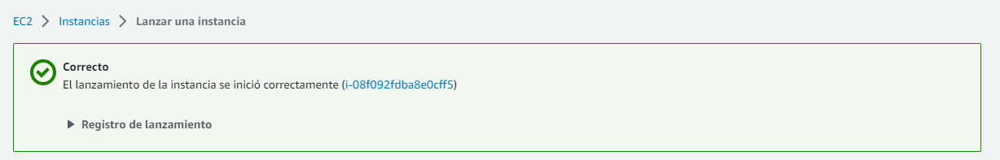
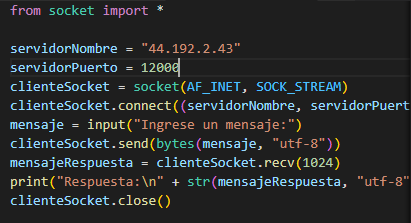
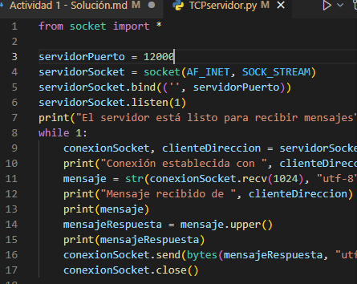
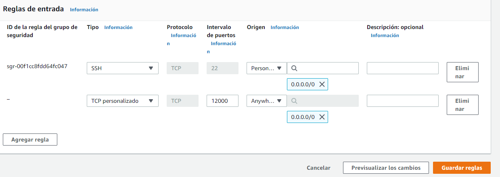
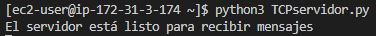
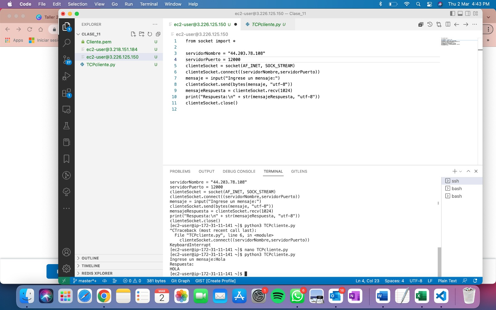
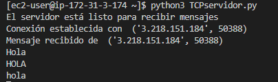

# Actividad 1

### Redes y Aplicaciones

##### Analítica Computacional para la Toma de Decisiones

---

|     Nombres      |      Apellidos       |     Login     |  Codigo   |
| :--------------: | :------------------: | :-----------: | :-------: |
|     Santiago     | Gonzalez Montealegre | s.gonzalez35  | 202012274 |
| Juliana Carolina |  Cardenas Barragan   | jc.cardenasb1 | 202011683 |

---

---

3. Lance una máquina virtual

4.

- Servidor: 44.192.2.43
- Cliente: 3.218.151.184

5. Modifique archivos

7. Abra el puerto

8.

- Ejecute el servidor

- Ejecute el cliente

- Ingrese un mensaje

